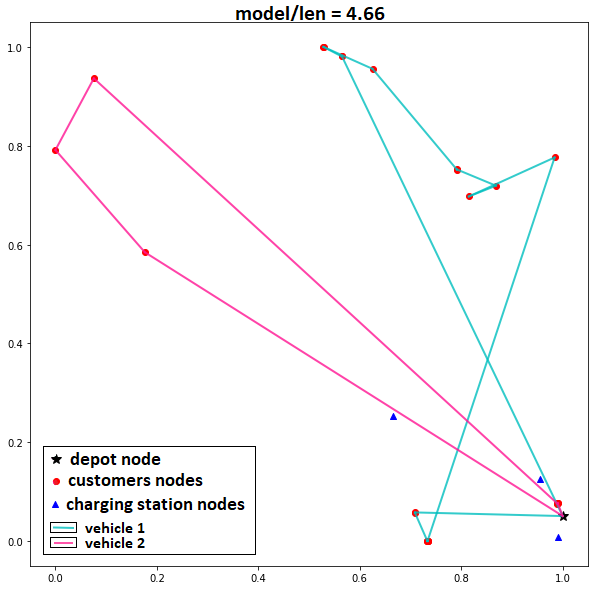
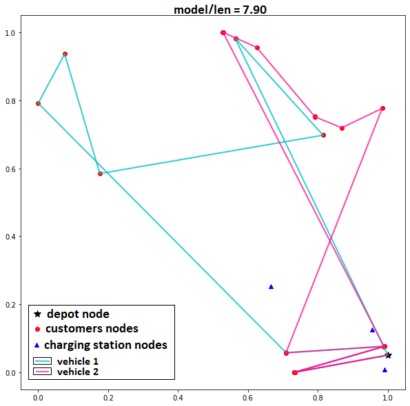
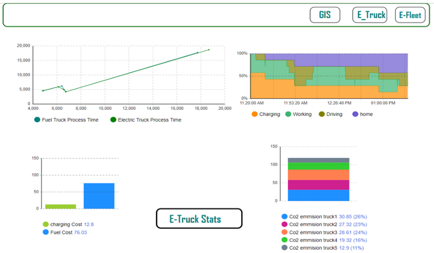

<h1 align="center"><b>PowerTrip</b></h1>

<p align="center">
  
  
  
</p>

## <b>Paper</b>
For more details, please see our paper A Novel Routing Solution for EV Fleets: A Real-World Case Study Leveraging Double DQNs and Graph-Structured Data to Solve the EVRPTW Problem, which has been accepted at IEEE ACCESS. If this code is useful for your work, please cite our paper:
> **Nouicer, Dimeth; Msadaa, Ikbal Chammakhi; Grayaa, Khaled.**  
> *A Novel Routing Solution for EV Fleets: A Real-World Case Study Leveraging Double DQNs and Graph-Structured Data to Solve the EVRPTW Problem.*  
> IEEE Access, vol. 11, pp. 122116–122127, 2023.  
> DOI: [10.1109/ACCESS.2023.3327324](https://doi.org/10.1109/ACCESS.2023.3327324)

### BibTeX:
````bibtex
@ARTICLE{10295443,
  author  = {Nouicer, Dimeth and Msadaa, Ikbal Chammakhi and Grayaa, Khaled},
  title   = {A Novel Routing Solution for EV Fleets: A Real-World Case Study Leveraging Double DQNs and Graph-Structured Data to Solve the EVRPTW Problem},
  journal = {IEEE Access},
  year    = {2023},
  volume  = {11},
  pages   = {122116--122127},
  doi     = {10.1109/ACCESS.2023.3327324},
  keywords = {Routing; Electric vehicles; Feature extraction; Costs; Vehicle dynamics; Optimization; Charging stations; Reinforcement learning; Deep reinforcement learning; DDQN; electric vehicles; EVRPTW; fleet; graph structure}
}
  
## <b>Introduction</b> 

Climate change is one of the most pressing challenges of our time, with transportation being a major contributor to global CO2 emissions. The United Nations' **Sustainable Development Goals (SDGs)** emphasize the need for sustainable cities and communities (**SDG 11**), climate action (**SDG 13**), and affordable, clean energy (**SDG 7**). A key component of achieving these goals is the **transition to sustainable transportation**.

Fleet operations, including logistics, public transport, and corporate vehicle fleets, are integral to modern economies but also significant sources of greenhouse gas emissions. The inefficient use of fossil fuel-powered fleets accelerates climate change, while the shift to **electric vehicles (EVs)** introduces challenges such as range anxiety and charging infrastructure limitations.

This project directly contributes to advancing sustainable transportation by optimizing fleet operations through **AI-driven route and schedule management**. By reducing fuel consumption, lowering emissions, and enabling seamless EV adoption, this solution aligns with global efforts to create a **cleaner, more efficient, and more sustainable transport system**.

---

## <b>Table of Contents</b>

- [**What is a Fleet?**](#fleet)
- [**Project Overview**](#project-overview)
- [**Why This Project Matters**](#why)
- [**Impact of Fleet Optimization**](#impact)
- [**Results**](#results)
- [**Technology Stack**](#Technology-Stack)
- [**Installation**](#installation)
- [**Usage**](#usage)
- [**Experiments**](#experiments)
- [**Contributing**](#contributing)
- [**License**](#license)

## <b>What is a Fleet?</b>

A fleet is a group of vehicles managed by a company or organization for operational purposes. These vehicles can be used for logistics, deliveries, public transport, corporate commuting, or emergency services.
Examples of Fleets:
- **Logistics Fleets**: Trucks and delivery vans for e-commerce and supply chains.
- **Public Transport Fleets**: Buses, taxis, and ride-sharing services.
- **Corporate Fleets**: Company-owned vehicles used for employee transportation.
- **Municipal Fleets**: Garbage trucks, emergency vehicles, and government transport services.

---

## <b>Project Overview</b>

Fleet operators face significant challenges in optimizing vehicle schedules and routes while minimizing carbon emissions. This project leverages **Deep Reinforcement Learning (DRL)** and **Graph Neural Networks (GNN)** to provide a scalable and intelligent **fleet optimization solution**. Our AI model dynamically adjusts vehicle schedules and routes based on real-time data, ensuring **fuel efficiency, lower operational costs, and reduced CO2 emissions**.

This project is designed to optimize fleets using both **Internal Combustion Engine (ICE) vehicles** (Diesel or Fuel vehicles) and **Electric Vehicles (EVs)**. For ICE vehicles, our solution helps **reduce CO2 emissions and carbon footprint** through efficient route planning and scheduling. For EVs, our model suggests the **optimal routes** to alleviate range anxiety, ensuring vehicles reach their destinations without unnecessary stops. Additionally, the model can recommend charging when needed and locate the **nearest charging station**, enhancing operational efficiency and reliability.

---

## <b>Why This Project Matters</b>
Climate change and increasing global carbon emissions make fleet optimization a crucial issue. Transportation accounts for a significant share of global CO2 emissions, and inefficient fleet management further exacerbates fuel waste and environmental impact. Our project presents a cutting-edge AI-driven solution that helps businesses transition to sustainable and eco-friendly fleet operations.
### Encouraging the Adoption of EVs in Fleets

Transitioning to electric vehicle (EV) fleets is essential for sustainable transportation, but many fleet operators hesitate due to concerns over charging infrastructure, operational disruptions, and battery range anxiety. This project actively addresses these challenges by:
- ✔ **Providing Optimal Route Planning for EVs:** Ensuring vehicles take the most efficient paths while considering charging station availability and battery levels.
- ✔ **Reducing Range Anxiety:** Dynamically suggesting the best times and locations for charging, preventing unexpected battery depletion.
- ✔ **Enhancing Operational Efficiency:** Intelligent scheduling minimizes downtime, making EV adoption more practical and profitable for fleet operators.
- ✔ **Facilitating a Smooth Transition:** By optimizing both ICE and EV fleets within a single system, our solution allows businesses to gradually shift toward full electrification without operational setbacks.

By integrating smart fleet management with AI-driven optimization, this project makes EV adoption more feasible and attractive for companies, reducing their environmental footprint while improving overall operational efficiency.

- ✔ **Environmental Impact:** Our solution significantly cuts down carbon emissions, supporting a cleaner planet.
- ✔ **Innovation:** We leverage state-of-the-art AI techniques like DRL and GNN, setting us apart from traditional optimization methods.
- ✔ **Scalability:** Our framework adapts to diverse fleet sizes and industries, making it widely applicable.
- ✔ **Economic Benefits:** Reducing fuel costs and enhancing fleet efficiency leads to financial savings for businesses.
- ✔ **Real-World Applicability:** Our project can be deployed in logistics, public transport, corporate fleets, and municipal services, making a tangible impact on multiple industries.
- ✔ **Dual Optimization for ICE and EVs:** Unlike other solutions, we support both traditional and electric vehicle fleets, providing optimal route planning and intelligent charging recommendations.
- ✔ **Improved Energy Efficiency:** Our AI-driven routing and scheduling model ensures that fleets maximize energy use, reducing wastage and increasing operational efficiency.

---

## <b>Results</b>
Key results from our testing and real-world simulations include:
- Total traveled distance reduction by up to 41%
<p align="center"> 
  
  
</p>

- co2 emissions, Fuel and energy costs lowered by 21% simulated using Anylogic software
<p align="center"> 
  
</p>
These results highlight the real-world impact of our solution, reinforcing its value as a scalable and effective tool for fleet managers looking to reduce costs and support sustainable transportation.
---

## <b>Technology Stack</b>

- **Deep Reinforcement Learning (DRL):** Used to learn optimal fleet scheduling and routing policies.
- **Graph Neural Networks (GNN):** Utilized for modeling complex relationships in fleet operations.
- **Python 3.9.2:** The primary programming language for AI model development.
- **PyTorch:** Framework for building and training AI models.
---

## <b>Installation</b>

### Install required Python dependencies:
```bash
pip install -r requirements.txt
```

## <b>Usage</b>

### Project Demo 🎥
Click the link to watch the demo video:  
[Watch the video on Google Drive](https://drive.google.com/file/d/1S-k1EieBfIMk71TdebTM6zqbicm3xzyu/view?usp=sharing)


This project is designed to help optimize routes for Electric Vehicles (EVs) using Reinforcement Learning (RL) techniques. Below are examples of how you can use this project:

### Example: Test the Model
You can test the model using the provided dataset for Electric Vehicle Routing Problem (EVRP). To do this, run the jupyter notebook file:
```bash
jupyter notebook evrp.ipynb
```

## <b>License</b>

Distributed under the MIT License. See `LICENSE.txt` for more information.

<p align="right">(<a href="#readme-top">back to top</a>)</p>
